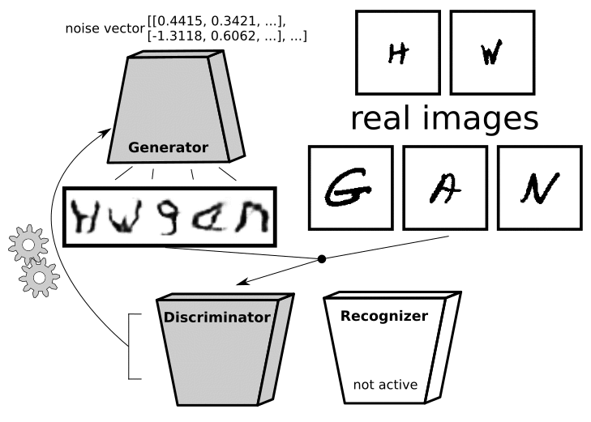

# HWGAN: Handwritten Text Generator

<p align="center">
  
</p>

<p align="center">
  <a aria-label="Python_shield" href="https://www.python.org/" target="_blank">
    
  </a>
</p>

This project was executed as a school assignment at the University of Twente. HWGAN is our own implementation of a handwriting generator build with a GAN and OCR neural network. The neural networks in this project have been build with [tensorflow](https://github.com/tensorflow/tensorflow).

## Project Overview

- School: University of Twente
- Course: Machine Learning II
- Assignment Type: Open Project
- Group Size: 4

## Setup

1. Use Python 3.6-3.8.
2. Execute the following command to install required packages:

```
pip install -r ./helper/requirements.txt
```

3. For GPU support we recommend to also install CUDA Toolkit 11.0, cuDNN 8.0.4 and NVIDIA GPU Driver 450 or higher ([NVIDIA website](https://developer.nvidia.com/cuda-toolkit))([TensorFlow guide](https://www.tensorflow.org/install/gpu)).

## Usage

- The training of the OCR and GAN models will by default use the [EMNIST ByMerge dataset](https://www.nist.gov/itl/products-and-services/emnist-dataset), for custom datasets please follow our [DATA_GUIDE](userinput/DATA_GUIDE.md). For training the neural networks on the default dataset use the following command:

```
python train.py
```

- To train on a custom dataset (raw images) make sure there is a folder named foldername in userinput:

```
python train.py foldername
```

- For creating a word you use the following command (where example_word is the word you want to create):

```
python run.py -text example_word
```

Available characters: 0123456789ABCDEFGHIJKLMNOPQRSTUVWXYZabcdefghijklmnopqrstuvwxyz\_

- For creating a word from your own dataset use the following command (where username is the same as foldername):

```
python run.py -user username -text hello world
```


## File Structure

     dataset
         ├── DATA_GUIDE.md                      # How to add custom datasets
         ├── ...                                # Location to add custom datasets
     helper
         ├── requirements.txt                   # Configuration file with all dependencies to install
         ├── split_data.py                      # Split the dataset into letter specific data
         ├── userinput.py                       # Handle user arguments
         ├── ()                                 # Custom images are split into characters
     models
         ├── gan_model/                         # Holds all files related to the GAN model
             ├── gifs/
                 ├── ...                        # .gif files of the training process
             ├── graphs/
                 ├── ...                        # Loss graphs of the training process
             ├── saved_models/
                 ├── ...                        # Trained discriminator and generator models
             ├── GAN.py                         # GAN model
         ├── ocr_model/                         # Holds all files related to the OCR model
             ├── ocr_model.h5                   # Trained OCR model
             ├── OCR.py                         # OCR model
             ├── ...                            # Stats on the performance
     out
         ├── ...                                # Output of the run.py executable
     train.py                                   # Main executable - Train all models
     run.py                                     # Main executable - Generate given word
     ...                                        # Extra project files

## Acknowledgments

The neural network setup has already been executed by [ScrabbleGAN](https://github.com/amzn/convolutional-handwriting-gan), which is a more elaborate implementation of this principal with [pytoch](https://github.com/pytorch/pytorch).
